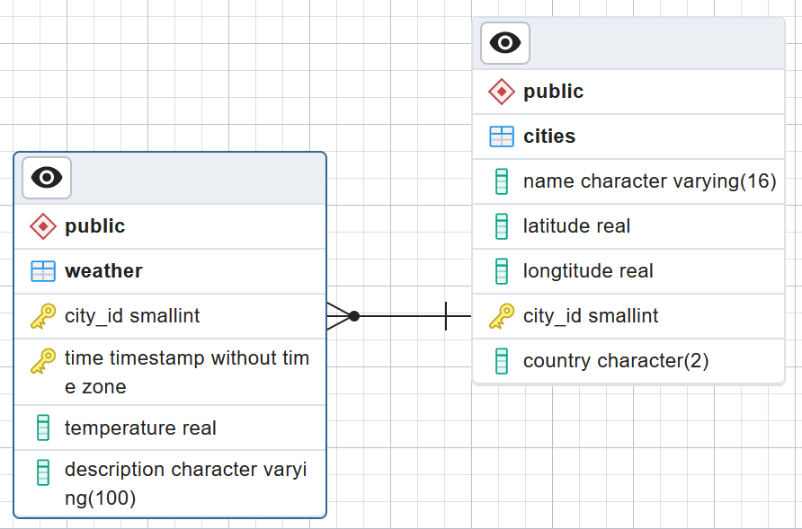

### Portfolio project
# Weather data system with Python and SQL

This is a project for Turing College Data Engineering course Module 2 Sprint 2. It's point is to get some weather data for certain cities from an external resource, parse it and store it in the database every hour. You also need to provide some analytical functions, that would query the data from the database and provide certain informations. Lastly, we were supposed to test the impact of using conurrency on fetching data.

The database used for this project should be backed up with cron hourly, have monitoring (dashboard from PgAdmin) and logging enabled (it is by default).

## Requirements
In order to replicate the project, you would need to have an operating system with capabilies to use cron, bash, PostgreSQL and PgAdmin. I have installed the following versions:
- Ubuntu GNU/Linux 22
- Python 3.10.12 (consult the requirements.txt for list of packages are needed)
- PostgreSQL 14.9 (from the package manager)
- PgAdmin 7.4 (from the DockerHub repository)

You need to have a PostgreSQL user with the login and password from the `.env` file, that would have full access to the `weather` database. The database structure needs to be like this:


You also need to make sure, that your user can log in to the database and PgAdmin is able to connect to your PostgreSQL server.

## Usage

1. You need to fill in some environment variables. Just copy and rename the `.env.sample` file and fill in the variables to suit your environment:
```bash
cp .env.sample src/.env
```

2. You need to upload cities, that you will work with, to the database. In order to find geographical location of the cities, you need to execute the `find_city_location.py` script. It will take the defined city names and convert them into the location, that we will use to find out weather data. The city list starts at line 52.

```bash
python3 src/find_city_location.py
```

NOTE: there were 20 cities mentioned in the project description, but only 19 provided that are not in sync with Wikipedia data. I decided not to change it, thus there are only 19 cities in the list.

3. The city description mentions getting the data into the database each hour. You can do that by adding a line:
```bash
10 * * * * python3 /home/ubuntu/jakluz-DE2.2/src/weather.py
```
to the user's crontab. The path might need some adjustments for you particular environment and you can add it with:
```bash
crontab -e
```
Just put it in the last line of this file and you'll be golden and the data will start to appear in your database, hopefully.

4. We are supposed to back up the data. Use the provided `cron/backup` Bash script to back up the data. There are some variables, that you can change to reflect your particular environment. Then put it in crontab as well:
```bash
crontab -e
```
adjust to your liking and paste it in the very last line:
```bash
15 * * * * /home/ubuntu/jakluz-DE2.2/cron/backup
```
this way you will have hourly backups, and only the last 24 will be kept. The logfile is present as well.

5. If you would find yourself in a situation, when you would neet to get some random data in the database to fill in the older database entries, the `fill_older_data.py` might help you. It would get the earliest entry from the `weather` table and populate some random data going back with hour interval.

6. You can check, how the concurrency works with the script `src/benchmark.py` and substituting the concurrency method. I was not able to make coroutines work, but for those that work I got the following results:

Sequential: 19 downloads in 2.30s
ThreadPool: 19 downloads in 1.76s
ProcessPool: 19 downloads in 0.76s

Those would be dependant on your machine thought. It seems, that ARM machine I am using does not work as well with threads as it does with processes. Sequential download is still the fastest one and would probably be sufficient for the task. You need to be aware of the OpenWeatherMap API limits for free tier, though.

## Analytics
I have created a `src/analytics.py` module, that could help you with analyzing the data about weather from the database. The usage samples are provided at the very end of the script itself.

## Improvements
I am well aware, that this project have some areas, that I could improve:
1. The very basic exception handling is present in all places, that I have found prone. However, the exceptions that are raised are too generic (pylint agrees). I could have better adjusted those to the particular situation, however I am not really sure which ones should I use and when.
2. The data, that my functions return are rather chaotic. They were implemented with the next function in mind, but I would need an architect to support me, or a more experienced developer.